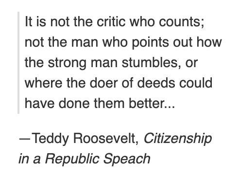
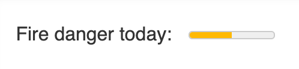

Web Developers deal with various languages according to their needs and work. But the basic is same for all which starts from [HTML](https://www.w3schools.com/html/) and [CSS](https://www.w3schools.com/html/). Beginners start from this amazing language and came to know almost everything about this language but still, there exist so many tags in [HTML](https://www.w3schools.com/html/) that we don't know. And same is with other languages. This is because developers can't go through each and everything.

So today, I am here with my next blog to discuss some extra lesser-known **HTML** Tags with you which, I just came to know a little bit before from our developers. Our team has worked with some wonderful HTML tags that exist officially as part of **HTML 5**. That's why this makes me curious to share these wonderful findings of our developer's team with you.

Here are some of the most underused and misunderstood tags in HTML. While they might be less familiar, they're still quite useful in certain situations.

- **`<del> and <ins>`**

  This is the tag named itself as delete and insertion Tag. This is basically used for text when some are to delete and some others to insert. This comes directly out of the semantic playbook to show that a piece of text should be deleted.
  An example of this is: "Pluto is isn't a planet."

In HTML, here is how that looks:

    
Pluto<del>is</del> <ins>isn’t</ins> a planet.

- **`<optgroup>`**

The `<optgroup>` tag is a great way to add a little definition between groups of options inside a select box. If you needed to group movie listings by time, for example, then it would look like this:

    <label for="showtimes">Showtimes</label>
    <select id="showtimes" name="showtimes"> <optgroup label="1PM"></optgroup> <option value="titanic">Twister</option> <option value="nd">Napoleon Dynamite</option> <option value="wab">What About Bob?</option>
    <optgroup label="2PM"></optgroup> <option value="bkrw">Be Kind Rewind</option> <option value="stf">Stranger Than Fiction</option> </select>

This basically helps to understand and opt for the option you want exactly.

- **`<abbr>`**

The `<abbr>` tag is only used to define abbreviated words. When any visitor hovers over the abbreviated text, the full definition appears below.
For example:

    
<abbr title="President of The United States">POTUS</abbr> rode his bicycle into a tree.

- **`<acronym>`**

The `<acronym>` tag defines or explains a group of words. When you hover over text where the `<acronym>` tag is used, a box appears following with the text from the title tag. For example:

    
The microblogging site <acronym title="Founded in 2006"> Twitter</acronym> has recently struggled with downtimes.

- **`<blockquote> & <cite>`**

For adding the content from a different source you actually need these tags. The blockquote and cite HTML tags are the semantic version of this that indicates the content is from an outside source.

Here is an example of this written out in HTML:

    <figure>
    <blockquote cite="[https://en.wikipedia.org/wiki/Citizenship_in_a_Republic](https://en.wikipedia.org/wiki/Citizenship_in_a_Republic)">

    
It is not the critic who counts; not the man who points out how the strong man stumbles, or where the doer of deeds could have done them better...

    </blockquote>

    <figcaption>--Teddy Roosevelt, <cite>Citizenship in a Republic Speach</cite></figcaption>
    </figure>

OUTPUT -

- **`<wbr>`**

The `<wbr>` tag is an incredibly vague tag. This tag allows you to specify a place where you think a line break might be useful, but only if needed. It's perfect for creating layouts that you want to avoid having horizontal scrollbars.
For Example:

    How do you say Supercalifragilistic `<wbr>` expialidocious?

- **`<meter>`**

Meter is a built-in range to show good, medium, or bad results. This gauge is a nifty tool built into browsers, created using much more custom code and JavaScript.
Here is what this looks like in HTML:

    <meter min="0" max="100" low="59" high="90" optimum="90" value="50">50%</meter>

and here what it look likes -

- **`<progress>`**

Both the progress and meter tags represent bars on a web page. Yet, the progress tag is designed to show how far onward something is, such as a project or task.
For example, Let's show a project that is 70 percent complete so, you could use this HTML:

    <progress id="project" max="100" value="70"> 70% </progress>

OUTPUT -

- **`<datalist>`**

The datalist tag is one I wish more developers should know about it. Often, developers will use complex JavaScript libraries to implement this same functionality, even though it already exists in HTML!
A datalist is an advanced drop-down to select something in a form. It can work as both a search and a drop-down.
Here is an example of how to implement this tag in HTML:

    <label for="flavor">Choose a flavor:</label>

    <input list="flavors" id="flavor" name="flavors" placeholder="Select flavor.." />

    <datalist id="flavors" >

    <option value="Orange">

    <option value="Mango">

    <option value="Pineapple">

    <option value="Chocolate">

    </datalist>

There are lots of great **HTML5-Based Tags** out there which are not known and not in use. HTML5 has done wonders for the web and continues to be a place of great innovation in browsers. So actually, this version has come with various amazing tags which only want your hard work for their findings.

I have shared some of the tags that attract me. But you can search for more if you need.

Have a great Reading with us.

Thank you!!
