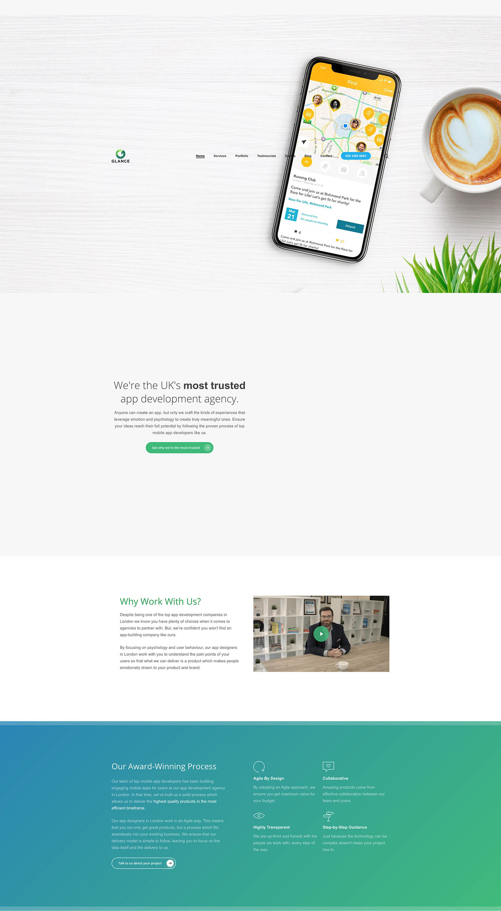

This is really simple example tutorial about how to crate pagination in NodeJs Application (it also covers ExpressJs Framework).
We will be using EJS templating system for demo purpose.

### Setup Application

To, start the tutorial let’s setup a new simple ExpressJs application by creating a file named `package.json` with following content:

```language-json
{
“name”: “nodejs-pagination”,
“version”: “0.0.1”,
“dependencies”: {
“ejs”: “~0.8.4”,
“express”: “~4.2.0”
},
“engines”: {
“node”: “>=0.10.0”
}
}
```

Then we will need to install required dependencies using `npm install` in the terminal. It will install all the required dependencies under `node_modules` directory.

### Create Index File to load App

Ok, now we have our simple demo application ready, let’s create a file which we will be using to run the application. So, go ahead and create `index.js` file with the following content:

```language-javascript
var express = require(‘express’);
var app = express();
app.set(‘views’, ‘views’);
app.engine(‘html’, require(‘ejs’).renderFile);
app.set(‘view engine’, ‘ejs’);
app.get(‘/’, function(req, res){
//set default variables
var totalStudents = 80,
pageSize = 8,
pageCount = 80/8,
currentPage = 1,
students = [],
studentsArrays = [],
studentsList = [];
//genreate list of students
for (var i = 1; i < totalStudents; i++) {
students.push({name: ‘Student Number ‘ + i});
}
//split list into groups
while (students.length > 0) {
studentsArrays.push(students.splice(0, pageSize));
}
//set current page if specifed as get variable (eg: /?page=2)
if (typeof req.query.page !== ‘undefined’) {
currentPage = +req.query.page;
}
//show list of students from group
studentsList = studentsArrays[+currentPage — 1];
//render index.ejs view file
res.render(‘index’, {
students: studentsList,
pageSize: pageSize,
totalStudents: totalStudents,
pageCount: pageCount,
currentPage: currentPage
});
});
var server = app.listen(3000, function() {
console.log(‘Listening on port %d’, server.address().port);
});
```

Let me explain this file, it’s really simple ExpressJs setup.

- First we initialize the ExpressJs App.
- Then we create a list of about 80 students.
- Then with a really simple trick, we split list of students. (I done this just for demo purpose). In real world applications we will get data from remote server or local database.
- Using line: `currentPage = +req.query.page;` we set current requested page eg: `http://localhost:3000/?page=2`.
- Finally, we pass all de required data to our view file, which we are going to create in next step.
  If you want to learn more about ExpressJs Framework, follow this link: [http://expressjs.com/guide.html](http://expressjs.com/guide.html)

### Create View file

Now, last step of app is create view file, which we are going name as `index.ejs` in `views` directory.

```language-html
<ul class=”list-group”>
<% students.forEach( function( student ) { %>
<li class=”list-group-item”><%= student.name %></li>
<% }) %>
</ul>
<% if (pageCount > 1) { %>
<ul class=”pagination”>
<% if (currentPage > 1) { %>
<li><a href=”/?page=1">&laquo;</a></li>
<% } %>
<% var i = 1;
if (currentPage > 5) {
i = +currentPage — 4;
} %>
<% if (i !== 1) { %>
<li class=”disabled”><a href=”#”>…</a></li>
<% } %>
<% for (i; i<=pageCount; i++) { %>
<% if (currentPage == i) { %>
<li class=”active”><span><%= i %> <span class=”sr-only”>(current)</span></span></li>
<% } else { %>
<li><a href=”/?page=<%= i %>”><%= i %></a></li>
<% } %>
<% if (i == (+currentPage + 4)) { %>
<li class=”disabled”><a href=”#”>…</a></li>
<% break; } %>
<% } %>
<% if (currentPage != pageCount) { %>
<li><a href=”/?page=<%= pageCount %>”>&raquo;</a></li>
<% } %>
</ul>
<% } %>
```

To complete the tutorial about expample include basic pagination. This is a simple EJS Embedded JavaScript file. More info on EJS can be found here: [http://embeddedjs.com/](http://embeddedjs.com/).
This is really basic example to demonstrate, you can amend it according to your needs.

### Run the application

Finally, to run the application and to see NodeJs Pagination in action run the following command in your terminal:
`node index.js`
Once it’s done, visit the page: http://localhost:3000 . On this page try to go different pages by clicking on pagination.
Hopefully this tutoral will help you in creating a really simple pagination for your nodejs application.
If you are looking for full source code from this tutorial, I have pushed it to github: [https://github.com/perminder-klair/nodejs-pagination-demo](https://github.com/perminder-klair/nodejs-pagination-demo) .

<!--  -->
