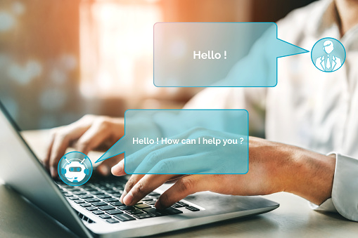
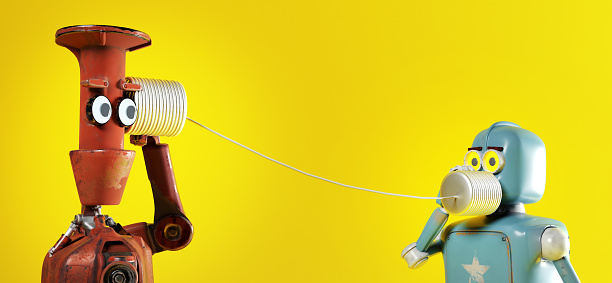

From the past few years, chatbots have been gaining so much popularity mainly because people started to  reimagine the ways chatbots could apply  in daily personal and business scenarios.

Technology innovation is something that can't stand still, always pushing to the next version for better enhancement.

And Chatbots are one of these innovations.

Today, many brands use chatbots to build a strong brand image and increase customer relationships by providing excellent customer services. Apart from customer service, chatbots will also be present in other sectors

So, Today we will here talk about Chatbots.

## **What are Chatbots?**

A chatbot can define as an AI-based computer program that resembles human conversations. They are also known as digital assistants that understand human capabilities.

Bots can communicate through voice, text and can deploy across websites, applications, and messaging channels such as Facebook Messenger, Twitter, or Whatsapp.

-   As per Gartner, in the next couple of years. 48% of the organizations will use chatbots for customer care, and 42% will deploy virtual assistants.

## **What The Future Exists For Chatbots And How It Will Impact You?**

So, the question stands: What is the future of chatbots?

Chatbot systems are growing day by day. Here are trends that can you assume for chatbots in the comings days, months, and years.

  

**More Human-Like**

Technology experts expect that chat will expand by market size in 2024, [up to $9.4 billion](https://www.marketsandmarkets.com/Market-Reports/smart-advisor-market-72302363.html). You can expect that chatbots will be the handling source in upcoming years in the entrepreneur landscape. As the chatbots industry continues to grow, it can be sure that this technology will have human-like attributes and approaches in the coming days.

  

**The Rise Of Voice Bots**

From Siri to Alexa, Google, these voice bots have now integrated with many lives. So when it combines with business, it can provide a seamless user experience to your customers. It can become more user-friendly as it is very convenient to use.

**Humanoid Chatbots**

Chatbots, which feel increasingly 'humanoid' is now broadly used. All thanks go to natural language processing (NLP). NLP lets chatbots communicate using complete sentences which have a natural, conversational flow.

**Automate Payments**

Enhancement in Chatbots innovates the way brands interact with their customers. This innovation will soon let to have automated payments. In the coming days, many businesses will beg chatbots in settling transactions that can process payment over live chat or even in Facebook Messenger apps. This bold move will offer convenience and efficiency to customers.

**Handle Complex Queries**

Chatbots are used by different companies to handle simple and repetitive tasks. However, you can expect that chatbot technology will handle complex queries and hard jobs in the coming days.

**Social Media and Chatbots**

Chatbots are very useful on the social media platform. As chatbots are AI-powered and, when you use them to combine with your social media marketing efforts, they can help you with your marketing efforts as they can track and understand various aspects of customer behaviours. It would be easy for you to understand the amount of time your customers spend online. You can also have an idea of the social media platform they prefer. What's the actual purpose for using social media etc.

**Problem-Solving**

One of the most exciting chatbot trends is fixing the common trouble of waiting in queue for your call to be answered at a call centre. While some issues require human support, chatbots are increasingly capable of resolving most of them.

**Continued Impacts Of Chatbots In Marketing**

The interaction between brands and consumers will become more streamlined in the future. As chatbots continue to grow, they will continue to make an impact on the way, businesses will promote their product and interact with their target market. It will also inspire better lead generation and improve communication with possible customers. Chatbots slowly becomes the landscape of business promotion and customer interaction.

Have a happy reading!
Thank you!!
