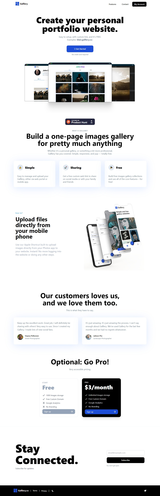
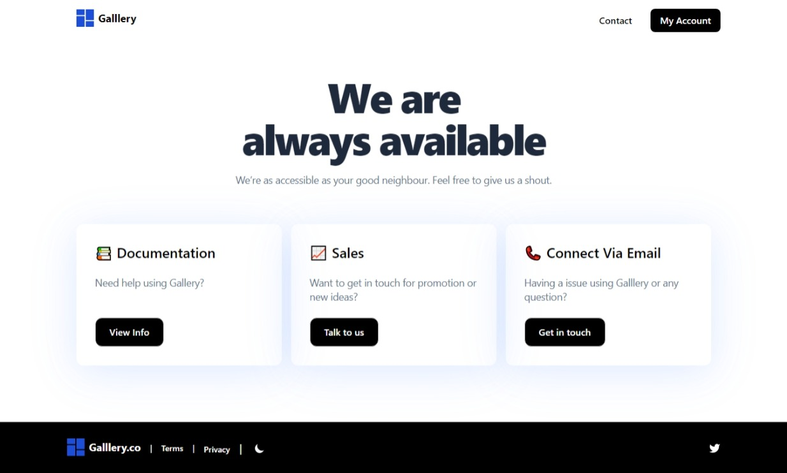
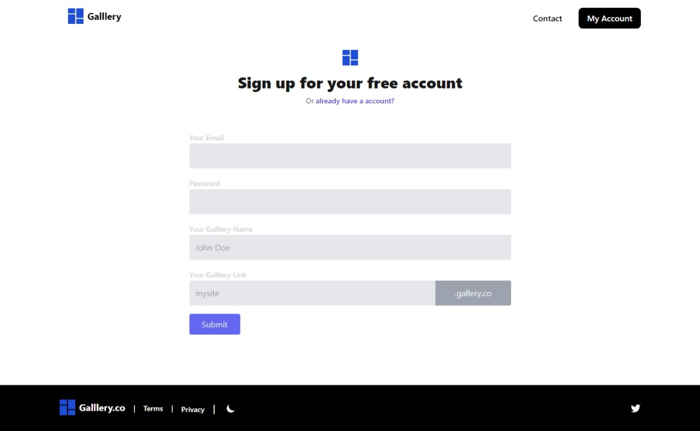

Create your personal portfolio website with Galllery Website.
Make your account and start building your own personal gallery.

This seems very interesting place where you can make your gallery to showcase high resolution images. You can share your experiences and memories on socialmedia so quickly and so easily.
Let's cover its Home Page, there below -

Contact Page -

Signing up Page -

If you want to explore it more, you can visit through link and check it.

If you like our work and wanna make deal with us, Contact Us anytime!!

Thanks for your Time!
