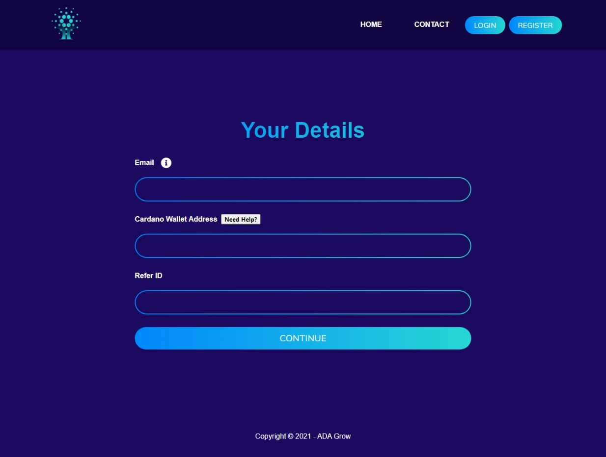

Smart contract technology is a new phenomenon in the modern decentralized economy. It allows, in accordance with the program code, to process and distribute the financial flows of digital assets. All processes take place in an open, decentralized blockchain network based on the Cardano cryptocurrency, the infrastructure of which supports the operation of such contracts.

Today, Everyone is watching their future in Digital CryptoCurrency. This Website is very Unique and smart Project that deals with Ada Crypto Currency. This is based on Blockchain Strategy.

Let's cover its Home Page, there below - 

Registering Page - 

If you want to explore it more, you can visit through link and check it.

If you like our work and wanna make deal with us, Contact Us anytime!!

Thanks for your Time!
 
