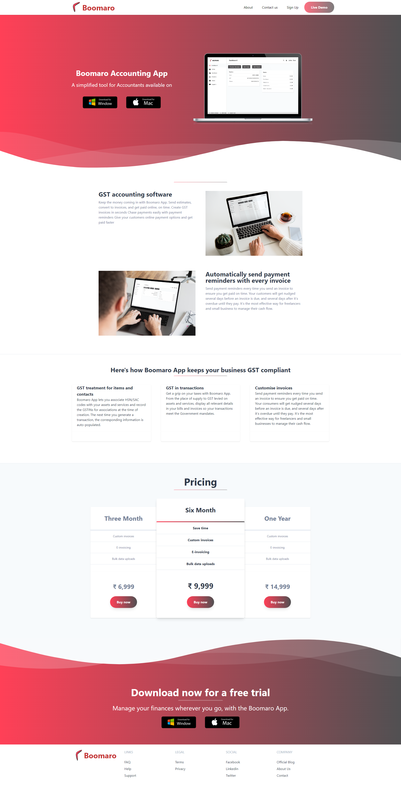

**GST accounting software.**

Keep the money coming in with Boomaro App. Send estimates, convert to invoices, and get paid online, on time. Create GST invoices in seconds Chase payments easily with payment reminders Give your customers online payment options and get paid faster.

**Automatically send payment reminders with every invoice.**

Send payment reminders every time you send an invoice to ensure you get paid on time. Your customers will get nudged several days before an invoice is due, and several days after it’s overdue until they pay. It’s the most effective way for freelancers and small business to manage their cash flow.
