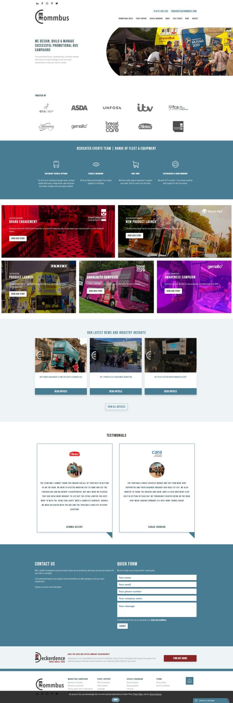

This is amazing project!

Commbus was formed in 1999 by its directors who, having worked together on several individual projects decided to combine their expertise together to provide a high quality professional service with individual solutions designed exactly to our clients specifications.

The Directors experience came from a wide variety of industry fields such as public address, lighting for stage and concerts, television, outdoor events, marketing and vehicle management. It provided a solid base to assist and support our client in every way to make every event an success. This unique collaboration of talent and experience has enabled Commbus to grow and provide solutions to clients by using the best resources to provide truly unique solutions. We are a dedicated close-knit team bring a wealth of experience between us all. No two days are every the same at Commbus and that is one of things we all love. You never know what each and every phone call is going to bring.

We are a dedicated close-knit team bring a wealth of experience between us all. Our team is big enough to manage large scale projects and small enough to care about the level of detail essential to the success of your project.
