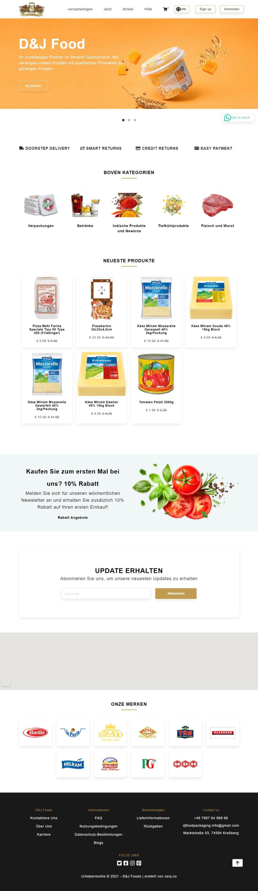
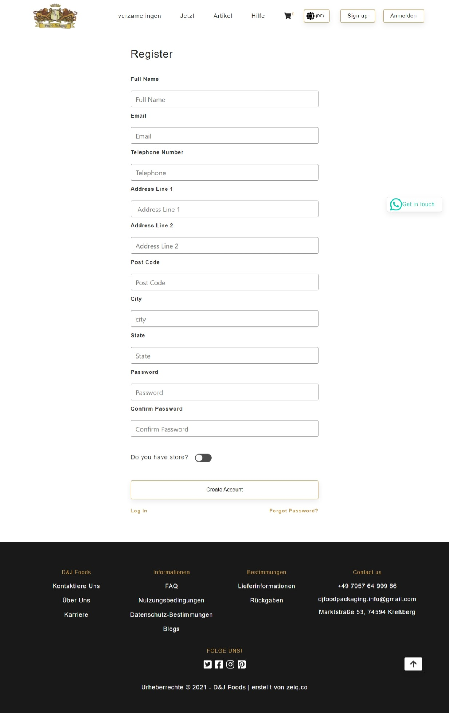

D & J Food is the E Commerce Website that have been supplying the customers with hight-quality food & packaging overall in german.
They attach great importance to high quality and customer satisfaction. Range includes more than 1000 different products. Whether for indian cuisine or for the kebab shop next door, They have the products everybody!

Let's cover its Home Page, there below -

And, the SIGN-UP Page -

If you want to explore it more, you can visit through link and check it.

If you like our work and wanna make deal with us, Contact Us anytime!!

Thanks for your Time!
