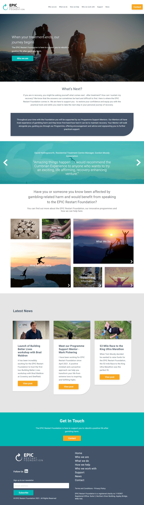
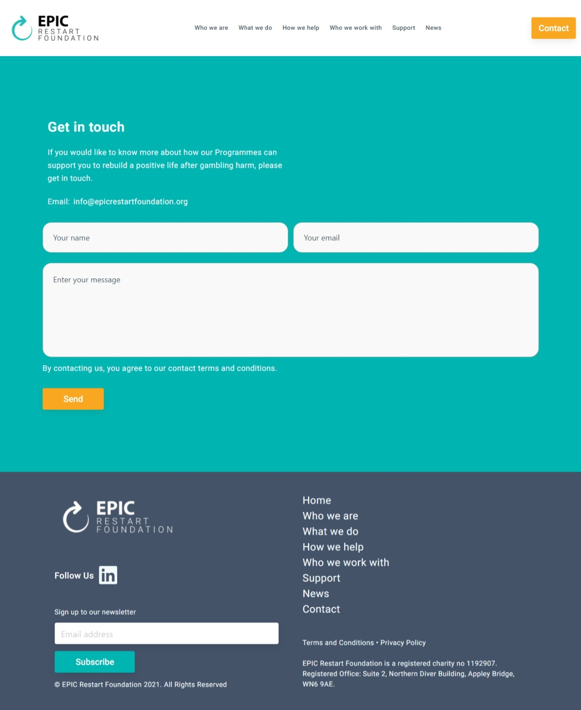

This is the Static Website which is not containing any animations or dynamically changing data on the site. This is very simple to build with using just React and Nextjs. But the point is what the website is telling us.
We feel so priviliged that we got this opportunity to present some Positive Vibes and to motivate others to live Positive Life after gambling Harm through developing this wonderful website.

The EPIC Restart Foundation is a new independent charity and our pilot Programme launched in Spring 2021.

The Foundation’s team of trustees and employees all come from different backgrounds but what unites us is our shared belief that all those who have suffered from gambling harm should be given the best chance to restart positive and fulfilled lives.

Let's cover its Home Page, there below - 

And, the Contact Page for contacting them - 

If you want to explore it more, you can visit through link and check it.

Personally, we suggest that if you are in contact with anyone who really needs to contact with this Association then must tell them or share this link with them so that we can revive someone's life.

If you like our work and wanna make deal with us, Contact Us anytime!!

Thanks for your Time!
 
