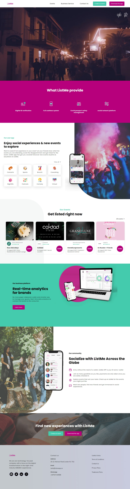

ListMe is one of our wonderful project that provide social experiences & new events to explore. Discover new events anytime & anywhere on ListMe.

**Get social & get listing**
Tailor your unique social life, meet new people and explore new brands all on ListMe

**Wallet Free**
With ListMe, your phone is the only thing you need to enjoy an event.

**Discover**
Meet new people, find new friends and get immersed in social experiences

Go and Visit the Site and Download the App.
Experience and Explore their Services and our work.

Share your response with us.

Thank You!!
