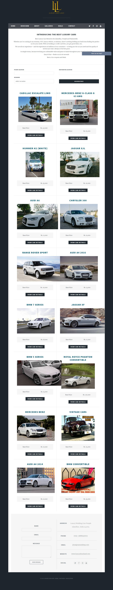

This is our another project dealing with Luxury Cars.

A **[luxury limoland](https://www.luxurylimoland.com/)** could refer to a company or organization that offers luxury transportation services using limousines. Such services may include airport transfers, corporate transportation, weddings, proms, and other special events.

Whether you’re cruising in an economy, SUV, luxury vehicle, or minivan, there’s nothing holding you back from finding the perfect car for your needs. With no booking or credit card fees, you get great deals, too..

**Luxury Limoland** provides premium transportation and luxury services to clients or guests, often catering to high-end clientele who are willing to pay a premium for an exclusive experience.

If you're interested in further exploration, feel free to follow the link provided to learn more.

If you appreciate our efforts and are interested in collaborating with us, please do not hesitate to reach out to us at any time.

Thank you for taking the time to read this.
