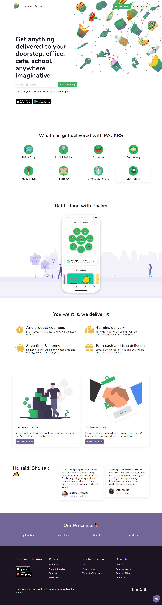

This is amazing project!

Hi, Packrs is a new age delivery platform created to ease the needs of the consumers. Packrs will make you forget the traditional ways of sending stuff around, no more queues, packrs comes in action when all hopes are lost and you have forgotten your important stuff at home, do not fret we will delivered it you in no time. Our motto is request anything from anywhere or get anything delivered at anywhere.

Founded in 2019 by Perminder Klair and like-minded guys, Packrs aims at transforming the present delivery system by making the delivery of everything possible from the comfort of your home with your mobile phone. Currently operating in Jalandhar, we are growing at a rapid pace in other cities as well. We have a close-knit team of developers, designers, digital marketers and social media managers who are working hard to offer perfect customer experience.

24\*7 strong customer support, strengthens our customer reach and service with no hassle at all.
