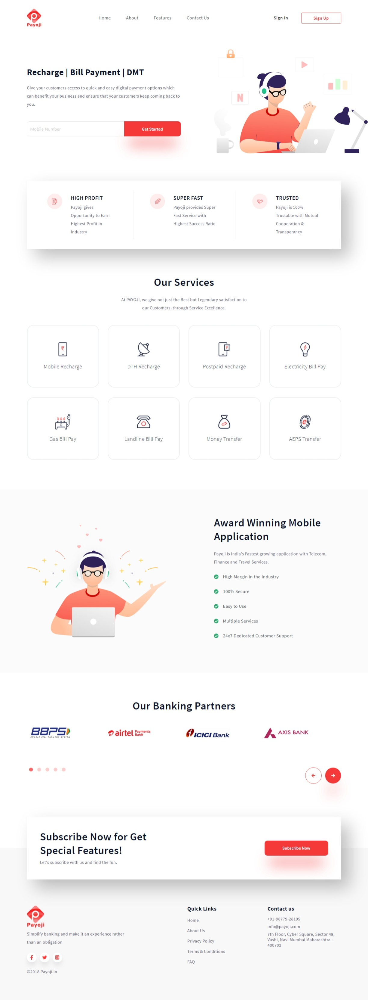
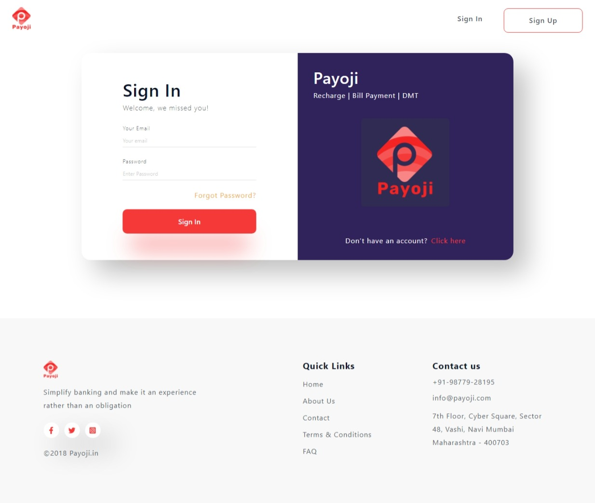
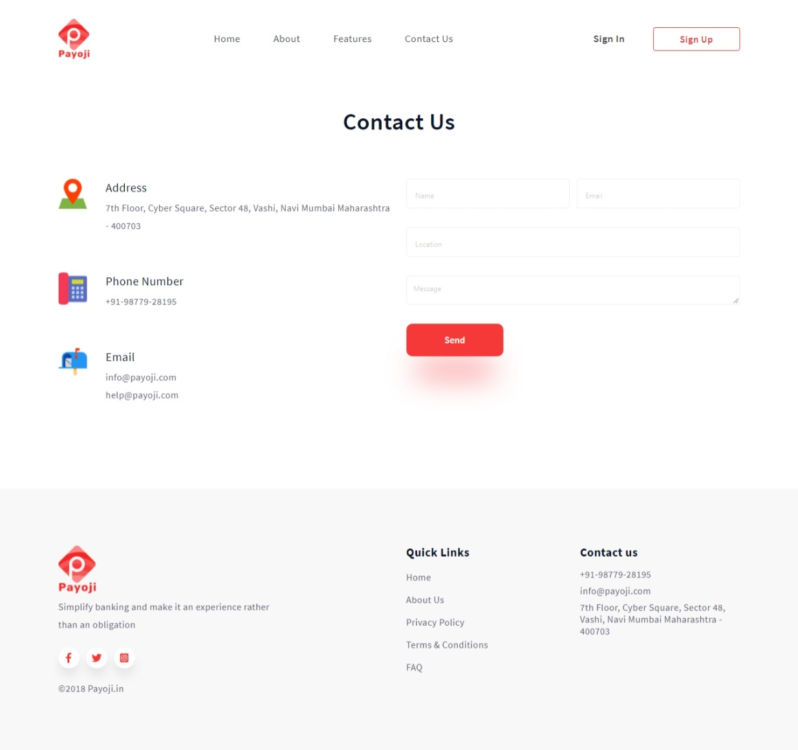
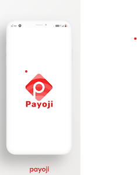
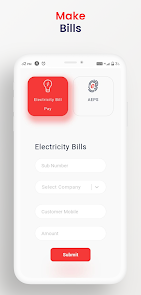

Here, This is one of the amazing project, we have done a little ago. Feeling so happy and exicted in sharing with you about this Financial Servicing Website(Business Website), **[Payoji](https://www.payoji.in/)**
PAYOJI Technologies India Limited is India's largest retailer and E-commerce company that has started to provide you the financial services, sales services via web portals as well as electronic payment services and many more.

Payoji provides services like Mobile recgarge, DTH recharge, Postpaid recharge, Electricity Bill Pay, Domestic Money Transfer and many more.
You can go and check the website for further Information - **[Payoji](https://www.payoji.in/)**
Payoji is having both its Website and App. You can download the app from Google Play and store it in your mobikes for future use.

There below, It is the Sign-in Page Demonstation. All the work has been done with using React (one of the most popular framework), Gatsby.
Go and Sign up, make your account and start doing online payments just with some clicks of your fingrs!!

So, having different pages, just giving the breif description here.
Tthis one seems our Contact Page that is holding all the indormation related the owners and if you have any queries, you can contact them.

It's App Look - 

This is 100% secured!!
Must Try it.
Thank you! 
 
