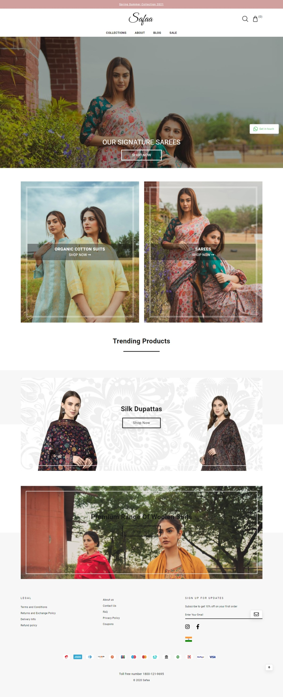
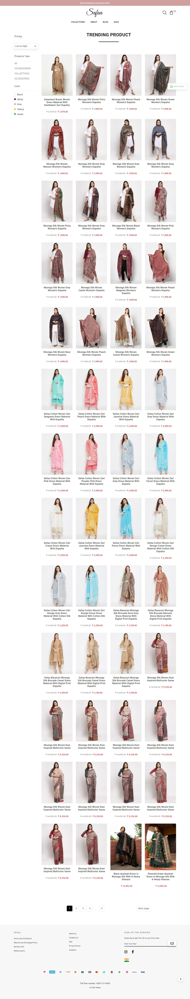

This is one another E Commerce Website for Shopping Purposes that provide products like Suits, Cotton Suits, Sarees, Silk Suits, Winter Wear, Dupatta, Stoles, Cottons of North and many more.

The brand’s unique collections are designed keeping in mind the needs of modern women who step into a variety of roles every day, both professional and personal. So, whether you are looking for a dazzling outfit to wear at a party or something more subdued for a casual meeting with a friend, or a statement piece such as an intricately woven shawl to liven up a plain outfit, Safaa will have something beautiful for you.

This is one of our finest and wonderful Website.
Let's cover its Home Page, there below -

And, the Sales Page -

If you want to explore it more, you can visit through link and check it.

If you like our work and wanna make deal with us, Contact Us anytime!!

Thanks for your Time!
