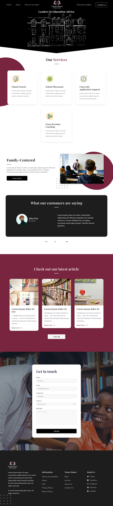

Turner House Education is one of the best platform in terms of education which believes that decisions about education should be exciting, not perplexing. Founder of Turner House says that our mantra is “Anything you do, do it well!” It brings different services for you including School Search, School Placement, University Application Support and Exam Revision Coaching.

This Turner House Platform is the amazing platform for taking any type of school related or education related advice for children and for their better future. With a multitude of options available, they specialise in supporting international parents with applications to British private schools. Led by your family’s requirements, we are committed to finding the best-fitting Independent school options for your child.
Their advice best suites to your child’s personality, interests and academic ability.

Get in Touch with the Leaders in Education Advice here anytime.
