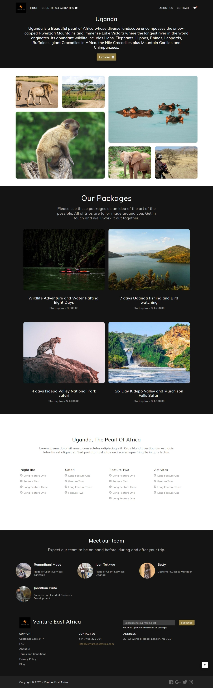
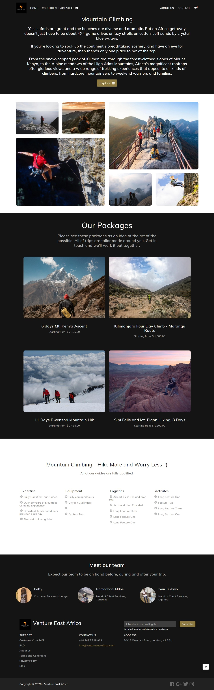

**[Venture East Africa](https://venture-east-africa.netlify.app/)** is the project of dealing with Adventurous Website where you can experience the glory of East Africa with focus on sustainable tourism and support for local communities.

Go and check thier offers and plan your Adventurous Trip with them.

#### _Let's have the adventurous Places provided by this Website_

### _Uganda_

### _Mountain Climbing_

### _Zanzibar_

An inimitable Indian Ocean island, off the coast of Tanzania, **Zanzibar** is the quintessential destination that affords superlative historical, cultural, exploratory and eco-tourism beach experiences in East Africa.

If you're interested in learning more about Venture East Africa, you can visit their website and check it out for yourself.

If you're impressed with what you see and are interested in working with us, please don't hesitate to get in touch!

Contact us anytime to discuss potential partnership opportunities.

Thanks for your Time!
